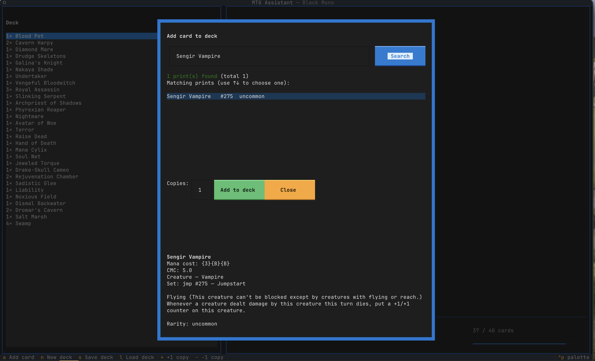
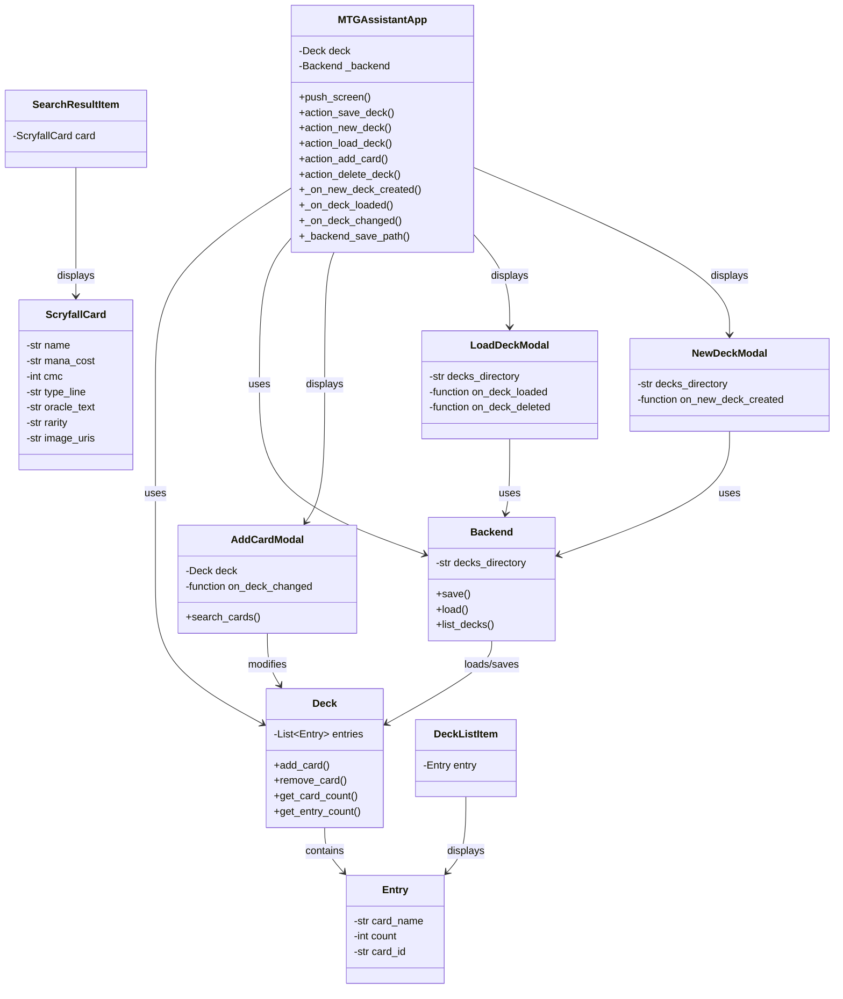

# MTG Assistant

MTG Assistant is a terminal-based Magic: The Gathering deck builder application built with Python and the Textual framework. It allows users to create, manage, and organize their Magic: The Gathering decks directly in the terminal.

## Features

- **Deck Management**: Create, load, save, and manage Magic: The Gathering decks
- **Card Search**: Integration with Scryfall API for searching and adding cards
- **Terminal Interface**: Modern, interactive TUI (Textual User Interface) built with Textual framework
- **Deck Limits**: Configurable limits for maximum cards and copies per card
- **Data Persistence**: Save decks to JSON files for later retrieval
- **Cross-Platform**: Runs on macOS, Windows, and Linux



## Installation

### Prerequisites
- Python 3.12 or higher
- uv

### Installation Steps
1. Clone or download the repository
2. Navigate to the project directory
3. Install the required dependencies:
   ```bash
   uv sync
   ```

## Getting Started

1. Run the application:
   ```bash
   uv run main.py
   ```

2. The application will initialize with a default deck and create necessary directories

3. Use the arrow keys to navigate the interface and enter key to interact with options

## Project Structure

```
mtg-assistant/
├── main.py                 # Main application entry point
├── config/
│   └── parameters.yaml     # Configuration file for Scryfall API URL and asset paths
├── libs/
│   ├── tui/                 # Textual User Interface components
│   │   ├── app.py           # Main application class
│   │   ├── add_card_modal.py # Modal for adding cards via Scryfall search
│   │   ├── formatting.py    # Text formatting functions for card display
│   │   ├── load_deck_modal.py # Modal for loading existing decks
│   │   └── new_deck_modal.py # Modal for creating new decks
│   └── utils/
│       └── formatting.py   # Utility functions for text formatting
└── assets/
    ├── decks/              # Directory for saved decks
    └── binders/            # Directory for saved binders
```

## Architecture Overview

### Core Components

The MTG Assistant follows a component-based architecture using the Textual framework:

1. Main Application (`MTGAssistantApp` in `libs/tui/app.py`)
2. Modal Screens for various operations (add card, load deck, new deck creation)
3. Data Models from external libraries (`Deck`, `Entry`, `Backend` from `pymtgdeck`)
4. Scryfall API Integration (`pyscryfall` library)

### Class Diagram



## Usage

### Main Interface

The main application window displays:
1. **Deck List** (left panel): Shows all cards in the current deck
2. **Card Details** (right panel): Displays detailed information about the selected card
3. **Navigation Controls**: Keyboard shortcuts for various operations

### Available Operations

- **Save Deck**: Press `s` to save the current deck
- **New Deck**: Press `n` to create a new empty deck  
- **Load Deck**: Press `l` to load an existing deck
- **Add Card**: Press `a` to search and add cards
- **Delete Deck**: Press `d` to delete the current deck from the filesystem

### Configuration

The application can be configured via `config/parameters.yaml`:
```yaml
base_url: "https://api.scryfall.com"
decks_directory: "assets/decks"
binders_directory: "assets/binders"
```

## Dependencies

The MTG Assistant requires the following Python packages:

- `pymtgdeck`: Core deck management library 
- `pyscryfall`: Scryfall API integration
- `pyyaml`: YAML parsing for configuration
- `textual`: Textual framework for terminal UI

## License

This project is licensed under the GPL v3 - see the LICENSE file for details.

## AI Disclosure

Part of this project has been developed with the assistance of an AI Model. I used a locally-hosted [Qwen3.5-Coder](https://ollama.com/library/qwen3-coder) quantized 30b model running on an M1-Pro Apple Macbook.

## Acknowledgments

- Thanks to the Scryfall API for providing card data
- Built with the [Textual](https://github.com/Textualize/textual) framework
- Uses [pymtgdeck](https://codeberg.org/mcaimi/pymtgdeck) for deck management functionality
- Uses [pyscryfall](https://codeberg.org/mcaimi/pyscryfall) for interactions with scryfall APIs