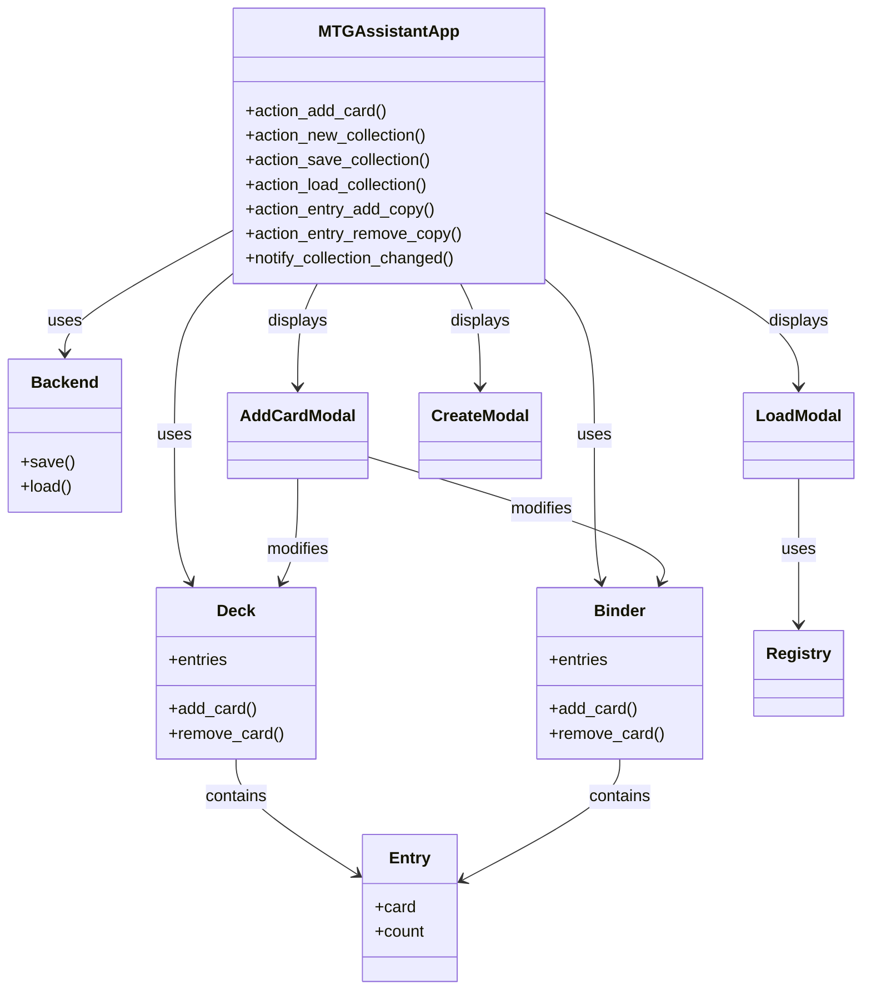

# MTG Assistant

MTG Assistant is a terminal-based Magic: The Gathering deck builder application built with Python and the Textual framework. It allows users to create, manage, and organize their Magic: The Gathering decks (and binders) directly in the terminal.

## Features

- **Deck and binder management**: Create, load, save, and switch between **decks** (60-card style limits from `pymtgdeck`) and **binders** (collections without those deck constraints)
- **Registry-based loading**: Saved decks and binders are listed together via `pymtgdeck`’s `Registry` under the assets root, so files in both deck and binder directories appear in one load dialog
- **Card search**: Integration with the Scryfall API for searching and adding cards to the open deck or binder
- **Terminal interface**: Interactive TUI built with Textual
- **Copy adjustment**: `+` / `-` on the main screen add or remove one copy of the highlighted card (deck legality rules apply when the collection is a deck)
- **Data persistence**: Collections save as JSON envelopes (`Deck` / `Binder`) through `pymtgdeck`’s `Backend`
- **Configurable paths**: `parameters.yaml` is loaded from the first existing path in a fixed search order (including a user config directory under the home folder)
- **Cross-platform**: Runs on macOS, Windows, and Linux

### Recent updates and fixes

- **Configuration resolution**: The app loads `parameters.yaml` from the first path that exists: `~/.config/mtg-assistant/parameters.yaml`, then `config/parameters.yaml` in the project, then `/etc/mtg-assistant/parameters.yaml`. This avoids silently ignoring a user-level config when a minimal project file is present.
- **Binders and decks**: `CreateModal` and `AddCardModal` work with either a `Deck` or a `Binder`; the header and size bar reflect deck limits vs binder totals.
- **Load dialog**: `LoadModal` replaces separate deck-only loading; it uses `Registry`, supports invalid-file rows with an error hint, and **`d`** deletes the highlighted file after a confirmation modal (no longer a global “delete current deck” shortcut on the main screen).
- **Dependency refresh**: Pinned `pymtgdeck==0.1.1` and `pyscryfall==0.1.2` with Textual 8.x.


## Installation

### Prerequisites
- Python 3.12 or higher
- uv

### Installation Steps
1. Clone or download the repository
2. Navigate to the project directory
3. Install the required dependencies:
   ```bash
   uv sync
   ```

## Getting Started

1. Run the application:
   ```bash
   uv run main.py
   ```

2. The application starts with an empty default **deck** and ensures the deck and binder asset directories exist (from your resolved config).

3. Use the arrow keys to move in lists, **Enter** to confirm, and **Escape** to close modals. The footer shows the main key bindings.

## Project Structure

```
mtg-assistant/
├── main.py                 # Entry point: resolve config, mkdirs, run TUI
├── config/
│   └── parameters.yaml     # Default in-repo config (overridden by user paths if present)
├── libs/
│   ├── tui/
│   │   ├── app.py              # MTGAssistantApp
│   │   ├── add_card_modal.py   # Scryfall search → add to deck or binder
│   │   ├── create_modal.py     # New deck or binder (+ deck limits)
│   │   ├── load_modal.py       # Registry-backed load + delete file
│   │   └── formatting.py       # Rich text for cards and entries
│   └── utils/
│       ├── __init__.py         # Parameters export + params_search_path
│       └── parameters.py       # YAML → nested Parameters objects
└── assets/
    ├── decks/              # Saved deck JSON files
    └── binders/          # Saved binder JSON files
```

## Architecture Overview

### Core Components

The MTG Assistant follows a component-based architecture using the Textual framework:

1. Main application (`MTGAssistantApp` in `libs/tui/app.py`) — holds either a `Deck` or `Binder`, two `Backend` instances (decks vs binders dirs), and a **registry root** (typically the parent of `assets/decks` and `assets/binders`) for discovery.
2. Modals: `AddCardModal`, `CreateModal`, `LoadModal` (plus confirm-delete sub-screen in `load_modal.py`).
3. Data models from `pymtgdeck`: `Deck`, `Binder`, `Entry`, `Backend`, `Registry`.
4. Scryfall integration via `pyscryfall`.

### Class Diagram



## Usage

### Main interface

The main window shows:

1. **Collection list** (left): Cards in the current deck or binder
2. **Card details** (right): Oracle text and metadata for the highlighted entry
3. **Size indicator** (footer): Deck shows count vs `max_card_count`; binder shows total cards

### Main key bindings

| Key | Action |
|-----|--------|
| `a` | Open add-card (Scryfall search) |
| `n` | New deck or binder (`CreateModal`) |
| `l` | Load a saved deck or binder (`LoadModal`) |
| `s` | Save the current collection to its backend directory |
| `+` / `-` | Add or remove one copy of the highlighted card |

### Load dialog (`l`)

- **Enter** on a row loads that file (invalid JSON shows an error instead of loading).
- **`d`** deletes the highlighted file after confirmation.
- **Escape** closes without loading.

### Configuration

The first existing file from this list is used:

1. `~/.config/mtg-assistant/parameters.yaml`
2. `config/parameters.yaml` (repository default)
3. `/etc/mtg-assistant/parameters.yaml`

Example shape (nested under `config`):

```yaml
config:
  base_url: https://api.scryfall.com
  assets_base_path:
    decks: ./assets/decks
    binders: ./assets/binders
```

`main.py` creates `assets_base_path.decks` and `assets_base_path.binders` if they are missing.

## Dependencies

| Package | Role |
|---------|------|
| `pymtgdeck` | Decks, binders, backends, registry |
| `pyscryfall` | Scryfall API |
| `pyyaml` | Configuration |
| `textual` | Terminal UI |

Pinned versions are listed in `pyproject.toml` (currently `pymtgdeck==0.1.1`, `pyscryfall==0.1.2`).

## License

This project is licensed under the GPL v3 - see the LICENSE file for details.

## AI Disclosure

Part of this project has been developed with the assistance of an AI Model. I used a locally-hosted [Qwen3.5-Coder](https://ollama.com/library/qwen3-coder) quantized 30b model running on an M1-Pro Apple Macbook.

## Acknowledgments

- Thanks to the Scryfall API for providing card data
- Built with the [Textual](https://github.com/Textualize/textual) framework
- Uses [pymtgdeck](https://codeberg.org/mcaimi/pymtgdeck) for deck and binder management
- Uses [pyscryfall](https://codeberg.org/mcaimi/pyscryfall) for interactions with Scryfall APIs
